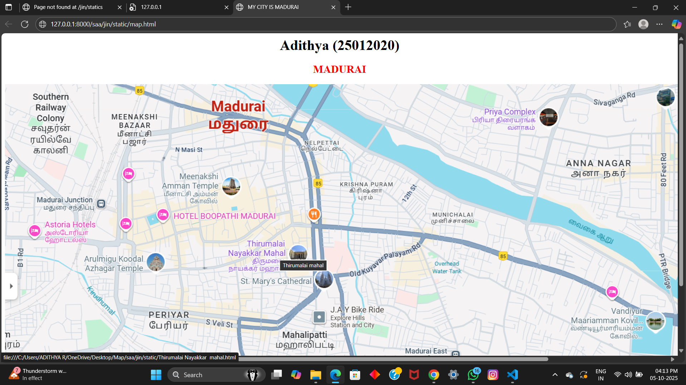
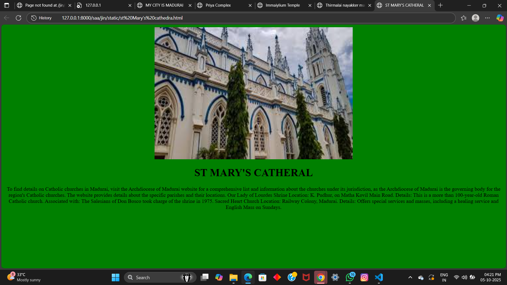
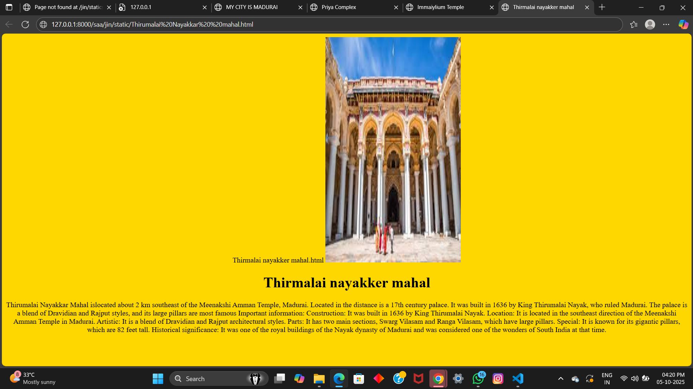
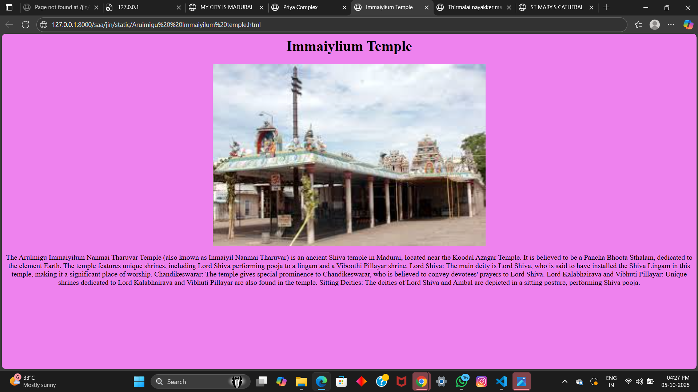
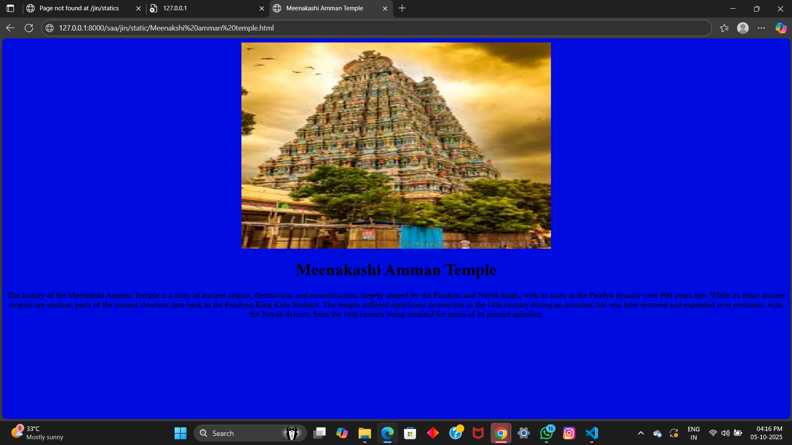

# Ex04 Places Around Me
# Date:05-10-2025
# AIM
To develop a website to display details about the places around my house.

# DESIGN STEPS
## STEP 1
Create a Django admin interface.

## STEP 2
Download your city map from Google.

## STEP 3
Using <map> tag name the map.

## STEP 4
Create clickable regions in the image using <area> tag.

## STEP 5
Write HTML programs for all the regions identified.

## STEP 6
Execute the programs and publish them.

# CODE
```
map.html
<html>
    <title>MY CITY IS MADURAI</title>

<body align="center">
    <h1 align="center">HARIKRISHNA.M (25013589)</h1>
    <h2 align="center" ><font color="red">MADURAI<font></h2>
    

    <map name="image-map" >
        <area target="" alt="Thirumalai Nayakkar  mahal" title="Thirumalai Nayakkar  mahal" href="C:\Users\acer\NearMe\maduraimapp\hariapp\static\Thirumalai nayakker mahal.html" coords="681,782,581,864" shape="rect">
        <area target="" alt="st Mary's cathedral" title="st Mary's cathedral" href="C:\Users\acer\NearMe\maduraimapp\hariapp\static\st Mary's cathedral.html" coords="751,926,43" shape="circle">
        <area target="" alt="Meenakshi amman temple" title="Meenakshi amman temple" href="C:\Users\acer\NearMe\maduraimapp\hariapp\static\Meenakashi amman temple.html" coords="354,503,393,530,388,584,320,581,307,527,430,496,449,550,447,579,403,601,357,599,334,600" shape="poly">
        <area target="" alt="Aruimigu  Immaiyilum temple" title="Aruimigu  Immaiyilum temple" href="C:\Users\acer\NearMe\maduraimapp\hariapp\static\immaiyilum temple.html" coords="106,779,25" shape="circle">
        <area target="" alt="priya complex" title="priya complex" href="C:\Users\acer\NearMe\maduraimapp\hariapp\static\priya complx.html" coords="1599,310,1667,245" shape="rect">
    </map>

</body>
</html>
Thirmalai nayakker mahal.html
<html>
    <head>
        <title>Thirmalai nayakker mahal</title>
    </head>
<body bgcolor="gold" align="center">
    
    <h1 align="center" >Thirmalai nayakker mahal</h1>
    <p align="center">Thirumalai Nayakkar Mahal islocated about 2 km southeast of the Meenakshi Amman Temple, Madurai. 
        Located in the distance is a 17th century palace. It was built in 1636 by King Thirumalai Nayak, who ruled Madurai.
       The palace is a blend of Dravidian and Rajput styles, and its large pillars are most famous
        Important information: 
        Construction: It was built in 1636 by King Thirumalai Nayak.
        Location: It is located in the southeast direction of the Meenakshi Amman Temple in Madurai.
        Artistic: It is a blend of Dravidian and Rajput architectural styles.
        Parts: It has two main sections, Swarg Vilasam and Ranga Vilasam, which have large pillars.
        Special: It is known for its gigantic pillars, which are 82 feet tall.
        Historical significance: It was one of the royal buildings of the Nayak dynasty of Madurai and was considered one of the wonders of South India at that time.
</p>
</body>


</html>

Aruimigu Immaiylium temple.html


<html>
    <head>
        <title>Immaiylium Temple</title>
    </head>
<body bgcolor="violet" align="center">
    <h1 align="center" >Immaiylium Temple</h1>
    
    <p align="center">
        The Arulmigu Immaiyilum Nanmai Tharuvar Temple (also known as Inmaiyil Nanmai Tharuvar) is 
        an ancient Shiva temple in Madurai, located near the Koodal Azagar Temple. It is believed to be a Pancha Bhoota Sthalam, dedicated to the element Earth. The temple features unique
         shrines, including Lord Shiva performing pooja to a lingam and a Viboothi Pillayar shrine.
        Lord Shiva: The main deity is Lord Shiva, who is said to have installed the Shiva Lingam in this temple, making it a significant place of worship. 
Chandikeswarar: The temple gives special prominence to Chandikeswarar, who is believed to convey devotees' prayers to Lord Shiva. 
Lord Kalabhairava and Vibhuti Pillayar: Unique shrines dedicated to Lord Kalabhairava and Vibhuti Pillayar are also found in the temple. 
Sitting Deities: The deities of Lord Shiva and Ambal are depicted in a sitting posture, performing Shiva pooja. 
    </p>

</body>


</html>

Meenakashi amman temple.html
<html>
    <head>
        <title>Meenakashi Amman Temple</title>
    </head>
<body bgcolor="light blue" align="center">
    
    <h1 align="center" >Meenakashi Amman Temple</h1>
    <p align="center">The history of the Meenakshi Amman Temple is a story of ancient origins, 
        destruction, and reconstruction, largely shaped by the Pandyan and Nayak kings,
         with its roots in the Pandya dynasty over 800 years ago. While its exact ancient origins are unclear, 
         parts of the current structure date back to the Pandyan King Kula Shekara. The temple suffered significant destruction in the 
        14th century during an invasion, but was later restored and expanded over centuries, with 
        the Nayak dynasty from the 16th century being credited for much of its present splendor. 
</p>
</body>


</html>
priya complex.html
<html>
    <head>
        <title>Priya Complex</title>
    </head>
<body bgcolor="violet" align="center">
    <h1 align="center" >Priya Complex</h1>
    <p align="center">The "Priya Complex" likely refers to Cinepriya Cinemas, a cinema located in Arignar Anna Nagar, Madurai, which was established in 1974. The term "complex" is often used to describe a multi-screen cinema facility, and Cinepriya is Madurai's earliest cinema. 
        Details about Cinepriya Cinemas: 
        Location: Arignar Anna Nagar, near Anna Bus Stand, on 80 Feet Road, Madurai-625020.
        Establishment Year: 1974.
        Status: It is a prominent and long-standing cinema in Madurai
    </p>
</body>

st Mary's catheral.html

</html>

<html>
    <head>
        <title>ST MARY'S CATHERAL</title>
    </head>
<body bgcolor="green" align="center">
    
    <h1 align="center" >ST MARY'S CATHERAL</h1>
    <p align="center"> To find details on Catholic churches in Madurai, visit the Archdiocese of Madurai 
        website for a comprehensive list and information about the churches under its jurisdiction,
         as the Archdiocese of Madurai is the governing body for the region's Catholic churches. 
        The website provides details about the specific parishes and their locations. 
        Our Lady of Lourdes Shrine
        Location: K. Pudhur, on Matha Kovil Main Road.
        Details: This is a more than 100-year-old Roman Catholic church.
        Associated with: The Salesians of Don Bosco took charge of the shrine in 1975. 
        Sacred Heart Church
        Location: Railway Colony, Madurai.
        Details: Offers special services and masses, including a healing service and English Mass on Sundays.
</p>
</body>


</html>
```
# OUTPUT





# RESULT
The program for implementing image maps using HTML is executed successfully.
